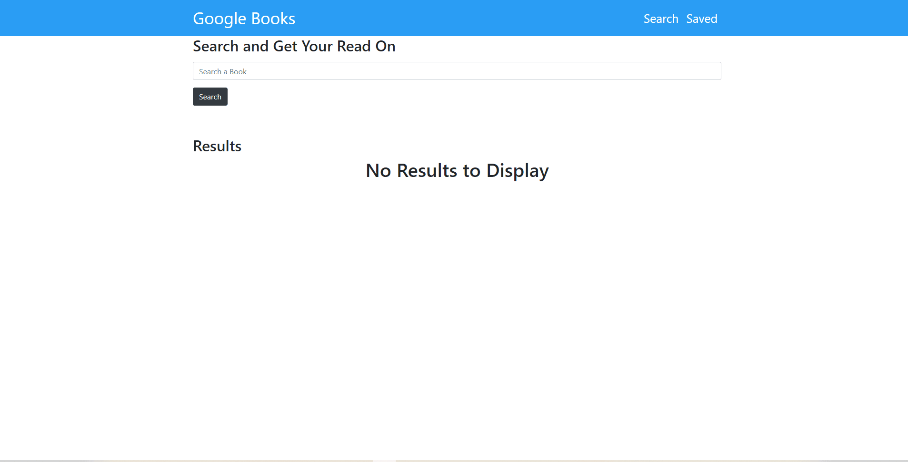

# Google Books Search    

### <a href="https://google-books-rq.herokuapp.com//">Deployed Application</a> 

## Description
This is an application that gives users the option to search Google Books API which then provides the book title, author, and a short summary. Additionally, users can save books to a depository for future access.

Technologies used:
React, JavaScript, HTML, CSS, Bootstrap, Heroku

